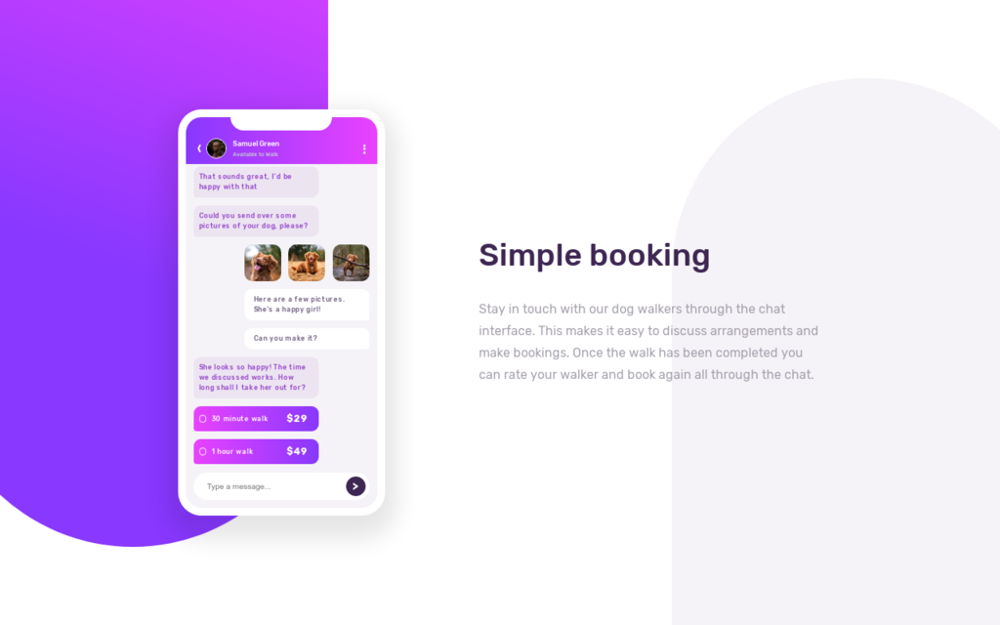

# Bookapp - Landing Page :D

> With Bookapp you can easily contact dog walkers to book your dog for a sweet walk :)



This repo contains a simple landing page for Bookapp.

## Built With

- Plain HTML, CSS and JS
- Assets management with Webpack

## Getting Started

To get a local copy of a dev environment up and running follow these simple steps.

### Prerequisites

- NPM and Node

### Install

1. Install dependencies. We are using npm for this

```
npm install
```

2. Run the dev server

```
npm start
```

### Usage

Go to [http://localhost:8080](http://localhost:8080) and see the page :)

## Contributing

Contributions, issues and feature requests are welcome :)

Feel free to check the [issues page](issues/).

## Show your support

Give a star if you like this project!
